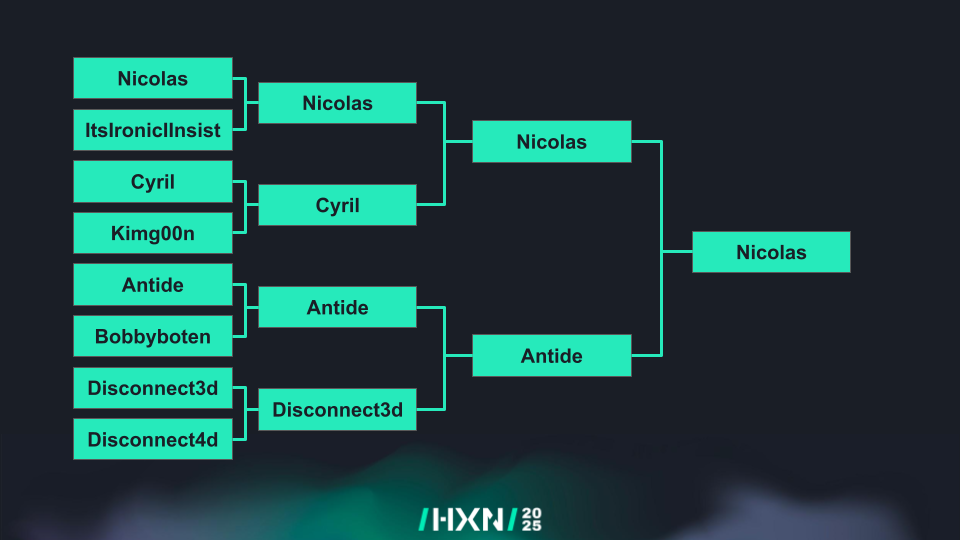

# Hexacon Speedrun 2025

This repository contains the challenges played during the Hexacon Speedrun 2025 CTF event.

## Challenges

- **Qualifier**
  - [vm_escape](challenges/quals/) (`pwn`)
- **Quarterfinals challenges (BO1)**
  - [Fast Encryptor](challenges/fast_encryptor/) (`rev`)
  - [Rubbish](challenges/rubbish/) (`rev`)
  - [Corrupted](challenges/corrupted/) (`pwn`)
  - [Vector](challenges/vector/) (`pwn`)
- **Semifinals challenges (BO1)**
  - [HHVM](challenges/hhvm/) (`web` / `revb`)
  - [Fair Dice](challenges/fair_dice/) (`crypto`)
- **Final challenges (BO3)**
  - [Babypac](challenges/babypac/) (`pwn`)
  - [YAKG](challenges/yakg/) (`rev`)

## Final Results



## Testing challenges

```shell
CHALLENGE="corrupted" # For example
make -C challenges/$CHALLENGE
# If the challenge requires a remote environment, spawn a container
if [ -d challenges/$CHALLENGE/docker ]; then
  docker compose -f challenges/$CHALLENGE/docker/docker-compose.yml up --build
fi
```

The files given to the players are located inside `challenges/$CHALLENGE/dist` directory.